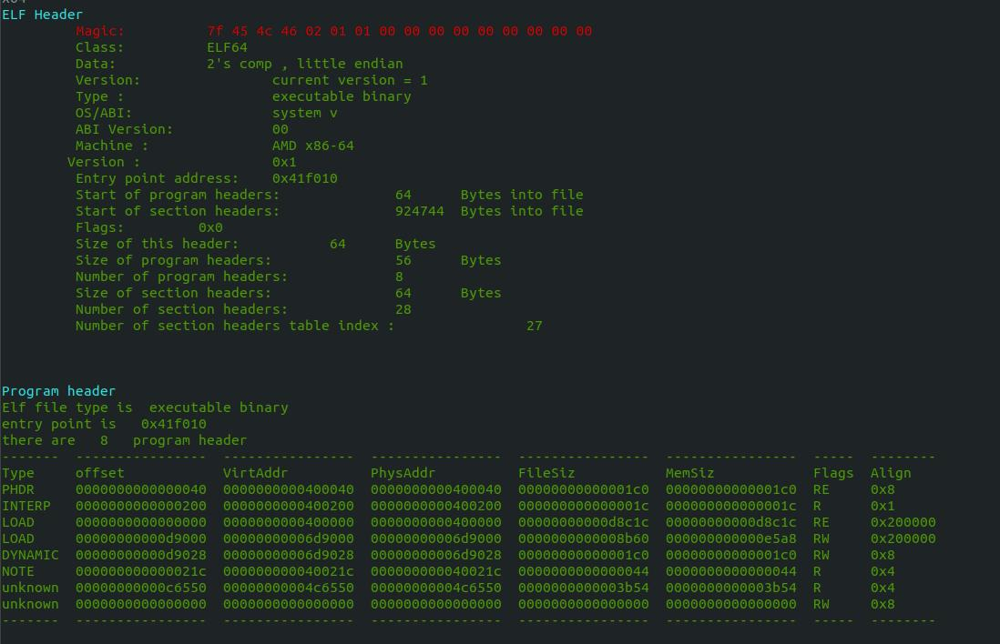
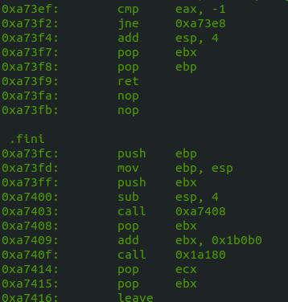
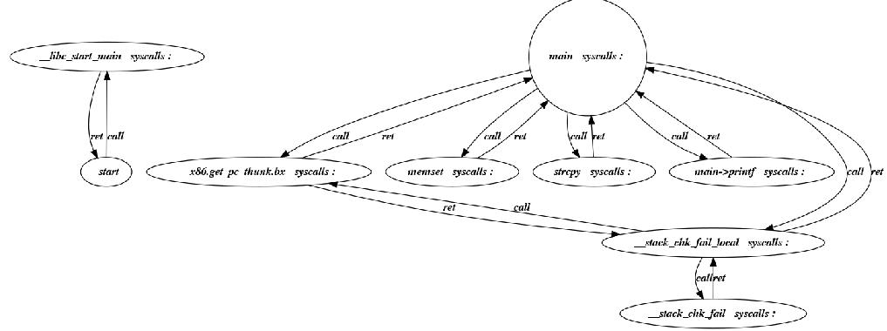
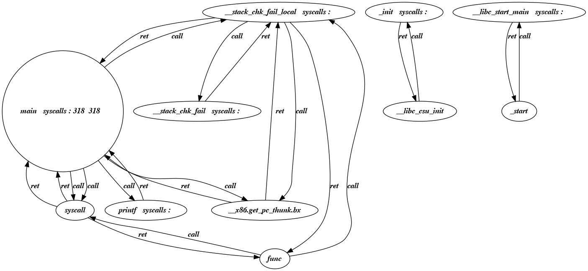

# ELFInspect

ELFInspect  is a Python-based utility designed to analyze ELF (Executable and Linkable Format) binary files. It offers functionalities for inspecting ELF headers, disassembling code sections, visualizing control flow graphs, and detecting potential vulnerabilities using syscall patterns.

## Project Overview

This project consists of three key components:

1. **ELF Header Extraction:**
   - Reads and displays ELF headers, including file, program, and section headers for both 32-bit and 64-bit architectures.
   - ELF binaries contain not only machine instructions but also metadata and structured sections.
2. **Binary Disassembly:**
   - Utilizes metadata from ELF headers to disassemble executable sections.
   - Leverages the Capstone disassembly engine to extract and interpret binary instructions.
3. **Call Graph Generation:**
   - Extracts dynamic and static function symbols from ELF binaries.
   - Constructs a function call graph to visualize application control flow.
   - Detects potential vulnerabilities using predefined syscall patterns.

## Features

- Supports 32-bit and 64-bit ELF binary analysis.
- Disassembles machine code for deeper insights into executable files.
- Generates detailed call graphs for control flow visualization.
- Enables syscall pattern detection to identify potential security risks.
- Provides a static vulnerability detection feature based on predefined patterns.

## Installation

Using python 3, Install dependencies: 

```bash
pip install -r requirements.txt
```


## Usage

1. **Analyze ELF Headers:**

ELF binary files contain three main headers: **file header, program header, and section header.**

- **File Header:** The ELF header determines whether 32-bit or 64-bit addresses are used. It consists of three fields affected by this setting, which also influence the offset of subsequent fields. The ELF header size is 52 bytes for 32-bit binaries and 64 bytes for 64-bit binaries.
- **Program Header:** This header, found in executable or shared object files, consists of an array of structures. Each entry describes a segment or provides information required for program execution.
- **Section Header:** This header helps locate all file sections. Each section header table entry provides data characterizing the section, such as a one-bit description of attributes.

In this project, ELF headers are extracted using these structures for both 32-bit and 64-bit formats. For better user experience, additional terminal display packages were used. Install them using the following commands:

**you can see example output of the first part in elf 64-bit format**



2. **Disassemble the Binary:**

The section header was utilized to extract and disassemble code from ELF-format files. To achieve this, since only executable files can be run, we first identify and extract the executable sections before passing them to the Capstone binary analysis tools.

you can see one example of the output of my dis-assembler : 



3. **Generate Call Graph with Syscall Detection:**

```bash
python BAT_Part2.py [binary-file] -s
```

In the final part of this project, I implemented a call graph generator using previously extracted data. To generate the call graph, we first need to extract ***dynamic and static tables*** for each function called in the application. Static symbols can be found in the `.symtab` section, while some symbols are dynamically addressed.

Next, we extract and resolve the dynamic symbol table using `rel.dyn` and `rel.plt` (for 64-bit, these sections are `rela.plt` and `rela.dyn`). At the end of this process, we obtain both dynamic and static symbol table rows. To visualize system calls, we detect them within disassembled sections and store them in each node of the call graph. To generate the call graph, we identify `call-ret` instructions in the code and map function names using dynamic and static symbol tables. The Graphviz library is used to generate graphs.



Certain software attacks can be detected by analyzing syscall patterns. To achieve this, we have implemented a ***syscall detection system*** in this project. Detection patterns can be specified in the `SyscallPattern.txt` file, where users can define custom syscall patterns to identify potential threats.




#### ‫‪Vulnerability Detection

ELFInspect includes a feature to identify potential vulnerabilities by analyzing function and syscall patterns. Users can define custom patterns in the following files:

- `SyscallPattern.txt` – Contains syscall patterns for detection.
- `FuncCallPattern.txt` – Allows users to define function call patterns.


**system call detection :** 


## Prebuilt Test Binaries

Sample ELF binaries are available in the `TestedBin` directory for quick testing.

## **Project Structure**

```bash
ELFInspect/
│-- BAT_Part2.py              # Main script for ELF binary analysis
│-- readelf.py                # Module for parsing ELF files
│-- dfs.py                    # Utility module (graph traversal)
│-- attr_types.py             # Attribute type definitions
│-- FuncCallPattern.txt        # Function call pattern definitions
│-- SyscallPattern.txt         # Syscall detection patterns
│-- requirements.txt           # List of dependencies
│-- README.md                  # Project documentation
├── TestedBin/                  # Sample ELF binaries for testing
├── output/                      # Directory for generated analysis results
├── images/                      # Images for documentation purposes
```

## Contribution

Feel free to submit issues or pull requests to enhance the tool's functionality.

## License

This project is licensed under the MIT License. 
