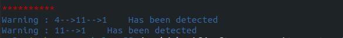

# BAT - Binary Analysis tool 

In this project, I designed and implemented a binary analysis tool for files in ELF binary format. This project includes three main sections:

- First, I read a binary main header content and print it as the result of an executable file (ex. an ’.exe’ file in windows) or an ELF binary (in Linux). It is not just made up of instructions in machine language, there are various sections and embedded metadata in this file. This project works for both 32/64 bit structures.
- Second, I wrote a dis-assembler for input binary files as the input. Dis-assembler is a tool that extracts instruction in binary format using metadata in header section. 
- Finally, I wrote a call-graph extractor for binary files. call-graph extractor needs to know every single dynamic and symbol-function address in binaries, therefore extracting dynamic symbol tables is another task that in this project.


### 1- Header extractor

we have three main headers in elf binaries format. **file header, program header, section header** 

- **File header**: The ELF header defines whether to use [32-](https://en.wikipedia.org/wiki/32-bit_computing) or [64-bit](https://en.wikipedia.org/wiki/64-bit_computing) addresses. The header contains three fields that are affected by this setting and offset other fields that follow them. The ELF header is 52 or 64 bytes long for 32-bit and 64-bit binaries respectively 
- **Program header**: It is an executable or shared file object’s in the table of program header  which is an array of structures. Each program header describes a segment or any other information that the system needs to prepare the program for execution. 
- **Section header**: The section header **allows you to locate all of the file sections**. An entry in a section header table contains information characterizing the data in a section. Description: One-bit descriptions of section attributes

in this project, I extract headers [using these structures](https://en.wikipedia.org/wiki/Executable_and_Linkable_Format) for 64/32 bit. for better user experience I used some packages to print in terminals, install them using the following instruction. 

 

```
‫‪pip‬‬ ‫‪install‬‬ ‫‪tabulate‬‬
‫‪pip‬‬ ‫‪install‬‬ ‫‪colorama‬‬
```


**you can see example output of the first part in elf 64-bit format**


### 2- Dis-assembler using header 

In the previous section, we extract all the tables such as program and  metadata file of section header. I used section header to extract and dis-assemble codes in files with ELF format. To to this, first of all, becauset just executable files can be run, we extract just these sections and pass them to the capstone binary tools.


I use capstone tools to read and dis-assemble executable sections in this part of the project., you can install this package using the python package manager :

```
pip install capstone 
```

**note: use python3 package managers to install and run the application**

you can see one example of the output of my dis-assembler : 


### 3- Application Call Graph 

In the last part of this project, I implemented the call graph generator using previously extracted data. To generate the call graph, first of, all we should extract ***dynamic and static tables*** of each function called in the application. For the static symbols, we can find all of their offsets in the .symtab section. However, some of the symbols are addressed dynamically.

Then, we extract and resolve the dynamic symbol table using rel. ***Dyn and rel. plt (for 64 bit this section is rela. plt and rela.dyn )***. At the end of the reservation process we have every dynamic and static symbol table row. To make syscalls visual we detect them in dis-assembled sections and save them to every node in the Call graph. To generate a call graph we detect call-ret instruction in code and then we detect the name of every function using dynamic and static symbol tables. I used the Graphviz library to generate graphs. use the below instruction to install this library : 

```
pip install graphviz 
```


There are some attacks on softwares that we can detect them using syscalls patterns. To do this, we implement ***a syscall detection system*** in this project. To check detection patterns we can use the SyscallPattern.txt file. you can define every syscall pattern in this file.

**Note: you should define syscall pattern exactly based on this file format to detect attacks and syscall patterns** 


As you see, I save every system calls in the function node. **Dynamic functions like syscall or printf that were extracted using dynamic symbol tables.**

#### ‫‪Statiⅽ‬‬ ‫‪Ⅾeteⅽtion‬‬ ‫‪of‬‬ ‫‪Vuⅼnerabiⅼities‬‬

in this part, we should detect Vuⅼnerabiⅼities‬‬ using static analysis. in this part we use two approaches: 

1. **Function call pattern** 
2. **system call patterns** 

For both approaches we use call graph and syscalls that we had saved them.

You can save function patterns in the FuncCallPattern.txt file. The first line contains the number of defined patterns and below it, you can define your pattern. The image below is an example of pattern detection 


**system call detection :** 




# run the application 

To run the application, after installing all the dependencies mentioned above, you can use this command :

```
python BAT_Part2.py [tested-binary] -s 
```

- Already, I make some binaries that exist in the TestedBin directory. The -s switch is used to save system calls in node so you can run the application without it. 
- output directory contains all the gvs format and imaged that show **call graph** 
