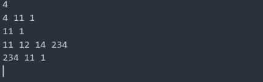

# BAT - Binary Analysis tool 

in this project, I designed and implement a binary analysis tool for elf binary format files. this project is split into three main tasks. 

- **in this part I read binary main header content and print it as result** An executable file (a ’.exe’ in windows) or an elf binary in Linux is not just made up of machine instructions, there are various sections and metadata embedded into the file. this project was designed for both 32/64 bit structure
- **at the second stage of this project I wrote a dis-assembler for the input binary files, dis-assembler** is a tool that extracts instruction in binary format using section header metadata. 
- **at the third stage of this project I wrote a Call-Graph extractor for binary files,** Call graph extractor needs to know every dynamic and symbol-function address in binaries, therefore extracting dynamic symbol tables is another task that is done in this project. 


### 1- Header extractor

we have three main headers in elf binaries format. **file header, program header, section header** 

- **File header**: The ELF header defines whether to use [32-](https://en.wikipedia.org/wiki/32-bit_computing) or [64-bit](https://en.wikipedia.org/wiki/64-bit_computing) addresses. The header contains three fields that are affected by this setting and offset other fields that follow them. The ELF header is 52 or 64 bytes long for 32-bit and 64-bit binaries respectively 
- **Program header**: An executable or shared object file's program header table is an array of structures, each describing a segment or other information the system needs to prepare the program for execution. 
- **Section header**: The section header **allows you to locate all of the file sections**. An entry in a section header table contains information characterizing the data in a section. Description: One-bit descriptions of section attributes

in this project, I extract headers [using these structures](https://en.wikipedia.org/wiki/Executable_and_Linkable_Format#:~:text=In computing%2C the Executable and,shared libraries%2C and core dumps.) for 64/32 bit. for better user experience I use some packages to print in terminals, install them using the following instruction. 

 

```
‫‪pip‬‬ ‫‪install‬‬ ‫‪tabulate‬‬
‫‪pip‬‬ ‫‪install‬‬ ‫‪colorama‬‬
```


**you can see example output of the first part in elf 64-bit format**


### 2- Dis-assembler using header 

in the previous section, we extract all the tables such as program and section header file metadata. I used Section header to extract and dis-assemble codes in elf file formats. first of all, we should know that just executable files can run, so we should extract just these sections and pass them to the capstone binary tools. 


I use capstone tools to read and dis-assemble executable section in this part of the project, you can install this package using the python package manager : 

```
pip install capstone 
```

**note: use python3 package managers to install and run the application**

you can see example output of dis-assemblers  : 


### 3- Application Call Graph 

In the last part of this project, I implement the call graph generator using previously extracted data. for the call graph generation first of all we should extract **dynamic and static tables** of every function called in the application. for the static symbols, we can find all of their offsets in the .symtab section. but some of the symbols are addressed dynamically. 

at the next step, we extract and resolve the dynamic symbol table using rel. Dyn and rel. plt (**for 64 bit this section is rela. plt and rela.dyn** ). at the end of the reservation process we have every dynamic and static symbol table row. to see syscalls we detect them in dis-assembled sections and save them to every node in the Call graph. To generate a call graph we detect call-ret instruction in code and then we detect the name of every function using dynamic and static symbol tables. I use the Graphviz library to generate graphs. use the below instruction to install this library : 

```
pip install graphviz 
```


there are some attacks on software that we can detect them using syscalls patterns, to use this approach we implement **a syscall detection system** in this project. to check detection patterns we can use **the SyscallPattern.txt** file. you can define every syscall pattern in this file.

**Note: you should define syscall pattern exactly based on this file format to detect attacks and syscall patterns** 


you can see that I save every system calls in the function node. **dynamic functions like syscall or printf extracted using dynamic symbol tables**

#### ‫‪Statiⅽ‬‬ ‫‪Ⅾeteⅽtion‬‬ ‫‪of‬‬ ‫‪Vuⅼnerabiⅼities‬‬

in this part, we should detect Vuⅼnerabiⅼities‬‬ using static analysis. in this part we use two approaches: 

1. **Function call pattern** 
2. **system call patterns** 

for both approaches we use call graph and syscalls that we saved them. 

you can save function patterns in **the FuncCallPattern.txt** file. the first line contains the number of patterns you would define and below, you could define your pattern. you can see an example of pattern detection below image : 


**system call detection :** 




# run the application 

to run the application, after installing all the dependencies described, you can use this command : 

```
python BAT_Part2.py [tested-binary] -s 
```

- already I make some binaries that exist in **the TestedBin** directory. **The -s switch** is used to save system calls in node and you can run the application without that. 
- output directory contains all the gv and imaged that show **call graph** 